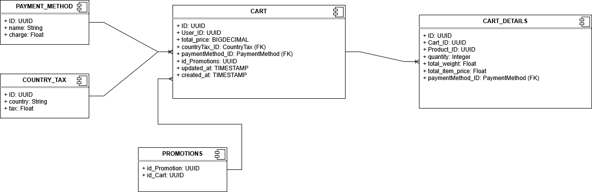
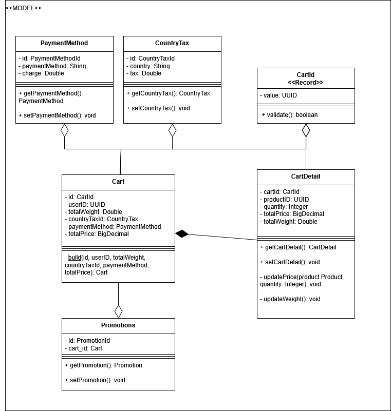

# 🛒 CARRITO API Endpoints

In this file you can see every endpoint of carrito service in order to perform any CRUD operation.

You can check some diagrams of the database used and domain class too.

It has been built following Domain Driven Design (`infrastructure`, `domain`, `application`).

---

## 🌱 API ROOT

http://localhost:8080/api/v1/carts

---

## 🔍 ENDPOINTS

## · Carts

| Method | Endpoint           | Descripción                     |
|--------|--------------------|---------------------------------|
| GET    | `/carts`           | Get all carts                   |
| GET    | `/carts/{id}`      | Get a cart by its ID            |
| POST   | `/carts`           | Create new cart                 |
| PUT    | `/carts/{id}`      | Update a cart by its ID         |
| DELETE | `/carts/{id}`      | Delete a cart by its ID         |
| DELETE | `/carts/user/{id}` | Delete a cart by its user ID    |

---

## · Carts

Each cart has the following fields:

| Campo           | Tipo             | Descripción                    |
|-----------------|------------------|--------------------------------|
| `userId`        | UUID             | ID of the cart's user          |
| `countryTax`    | CountryTax       | Tax applied by country         |
| `paymentMethod` | PaymentMethod    | Payment Method used            |
| `totalPrice`    | BigDecimal       | The sum of the price of all products|
| `totalWeight`   | Double           | The sum of the weight of all products|
| `createdAt`     | Date             | Date when the cart was created |
| `updatedAt`     | Date             | Date when the cart was updated |
| `cartDetails`   | List<CartDetail> | Order lines of one cart        |
| `state`         | CartState        | State of the cart              |
| `promotionIds`  | List<UUID>       | IDs of the promotions applied  |

## · Cart Details (embedded in cart)

Each cart detail has the following fields:

| Campo         | Tipo       | Descripción            |
|---------------|------------|------------------------|
| `quantity`    | int        | Amount of products     |
| `totalPrice`  | BigDecimal | Sum of the price of all products|
| `totalWeight` | Double     | Sum of the weight of all products|

## · Country Tax (embedded in cart)

Each country tax has the following fields:

| Campo         | Tipo   | Descripción       |
|---------------|--------|-------------------|
| `country`     | str    | Name of the tax   |
| `tax`         | double | Percentage (0..1) |

## · Payment Method (embedded in cart)

Each payment method has the following fields:

| Campo           | Tipo   | Descripción                 |
|-----------------|--------|-----------------------------|
| `paymentMethod` | str    | Name of the payment method  |
| `charge`        | double | Percentage (0..1)           |

## · Enum: Cart State

Here you can see all possible states of a cart (`state` field)

- `ACTIVE`

- `PENDING`

- `ABANDONED`

- `CLOSED`

---

## Database diagram

---

## Classes Diagram

